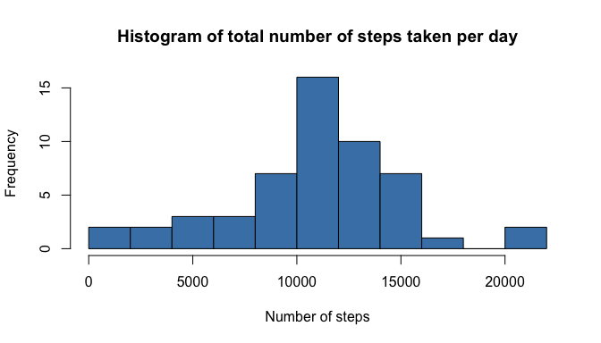
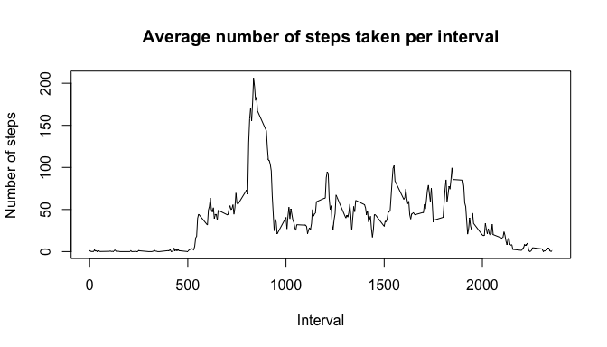
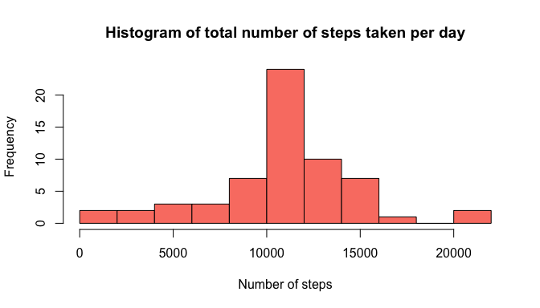
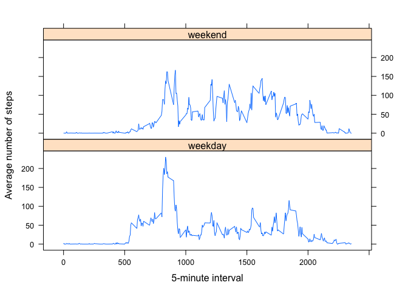

# Reproducible Research: Peer Assessment 1

## Loading and preprocessing the data

The data file "activity.zip" is already located in the GitHub directory. So there is no need to download the file. 

Show any code that is needed to

1. Load the data (i.e. read.csv())
2. Process/transform the data (if necessary) into a format suitable for your analysis


```r
# load the data
unzip("activity.zip")
data <- read.csv("activity.csv")
```


## What is mean total number of steps taken per day?

For this part of the assignment, you can ignore the missing values in the dataset.

1. Calculate the total number of steps taken per day


```r
# splitting my data frame by date
datesplit <-split(data, data$date)

#calculating the sum of steps for each data frame split by date
# and summarizing the result into an array
daily_steps <- sapply(datesplit, function(x) sum(x$steps))
```

2. If you do not understand the difference between a histogram and a barplot, research the difference between them. Make a histogram of the total number of steps taken each day.


```r
hist(daily_steps, breaks=10, col="steelblue", xlab="Number of steps", 
     main="Histogram of total number of steps taken per day")
```

 


3. Calculate and report the mean and median of the total number of steps taken per day.


```r
# Mean
mean_steps <- mean(daily_steps, na.rm=TRUE)
# Median
median_steps <- median(daily_steps, na.rm=TRUE)
median_steps
```

```
## [1] 10765
```

The mean number of steps per day is: 1.0766\times 10^{4}.

The median number of steps per day is:  10765.


## What is the average daily activity pattern?


1. Make a time series plot (i.e. type = "l") of the 5-minute interval (x-axis) and the average number of steps taken, averaged across all days (y-axis)


```r
# Splitting my data frame by interval and calculating the mean for each
# data frame, removing the NA values, and summarizing into an array. 

intervalsplit <- split(data, data$interval)
avgsteps_interval <- sapply(intervalsplit, function(x) mean(x$steps, na.rm =TRUE))
unique_intervals <- unique(data$interval)

# plotting the mean steps against interval. 
plot(unique_intervals,avgsteps_interval, type='l',
     xlab = 'Interval', ylab = 'Number of steps',
     main = "Average number of steps taken per interval"
     )
```

 

2. Which 5-minute interval, on average across all the days in the dataset, contains the maximum number of steps?


```r
max_index <- match(max(avgsteps_interval),avgsteps_interval)

maxSteps_inInterval <- max(avgsteps_interval)
maxInterval <- unique_intervals[max_index]
```

The 5-minute interval 835 contains the maximum number of steps (at 206.1698113 steps).


## Imputing missing values


Note that there are a number of days/intervals where there are missing values (coded as NA). The presence of missing days may introduce bias into some calculations or summaries of the data.

1. Calculate and report the total number of missing values in the dataset (i.e. the total number of rows with NAs)


```r
empty <- is.na(data)
missingValues <- length(data[empty])
missingValues
```

```
## [1] 2304
```

The total number of rows with missing values is: 2304


2. Devise a strategy for filling in all of the missing values in the dataset. The strategy does not need to be sophisticated. For example, you could use the mean/median for that day, or the mean for that 5-minute interval, etc.

My plan is to replace NAs values in the "Steps" column with the mean for that 5-minute interval. 

3. Create a new dataset that is equal to the original dataset but with the missing data filled in.


```r
# My dataframe split by date is called datesplit
# My vector of mean steps in 5min intervals is called avgsteps_interval
# replace NA values for steps in datesplit with average interval value from avgsteps_interval. 

datesplit_c <- datesplit
numberofdays <- length(datesplit_c)

for(i in 1:numberofdays){
    if (length(datesplit_c[[i]]$steps[is.na(datesplit_c[[i]]$steps)]) > 0){
    datesplit_c[[i]]$steps[is.na(datesplit_c[[i]]$steps)] <- avgsteps_interval
    }
}


# Creating a new dataset that is equal to the orginal but with missing data filled in.

data_complete <- do.call("rbind", datesplit_c)
```

4. a) Make a histogram of the total number of steps taken each day and 


```r
daily_steps_c <- sapply(datesplit_c, function(x) sum(x$steps))

hist(daily_steps_c, breaks=10, col="salmon", xlab="Number of steps",
     main="Histogram of total number of steps taken per day")
```

 

b) Calculate and report the mean and median total number of steps taken per day. 


```r
mean_complete <- mean(daily_steps_c)
mean_complete
```

```
## [1] 10766.19
```

```r
median_complete <- median(daily_steps_c)
median_complete
```

```
## [1] 10766.19
```

The mean number of steps per day is: 1.0766189\times 10^{4}.

The median number of steps per day is:  10765.

c) Do these values differ from the estimates from the first part of the assignment? 

The mean value stays the same. The median value has changed.

d) What is the impact of imputing missing data on the estimates of the total daily number of steps?

The total daily number of steps have increased because we've removed NA values, which were contributing nothing to the total number of steps, by a numerical value. 


## Are there differences in activity patterns between weekdays and weekends?


For this part the weekdays() function may be of some help here. Use the dataset with the filled-in missing values for this part.

1. Create a new factor variable in the dataset with two levels – “weekday” and “weekend” indicating whether a given date is a weekday or weekend day.


```r
dayofweek <- weekdays(as.Date(data_complete$date))
daytype <- ifelse(dayofweek %in% c("Saturday","Sunday"), "weekend", "weekday")
data_complete$daytype <- as.factor(daytype)
```

2. Make a panel plot containing a time series plot (i.e. type = "l") of the 5-minute interval (x-axis) and the average number of steps taken, averaged across all weekday days or weekend days (y-axis). See the README file in the GitHub repository to see an example of what this plot should look like using simulated data.


```r
# using aggregate to split on both day type (weekend/weekday) and interval
# and output mean number of steps.
daytypesplit  <- aggregate(data_complete$steps, by = list(data_complete$daytype, data_complete$interval), FUN = mean ,na.rm=TRUE)

# assigning names to new data frame so that I can split on them.
names(daytypesplit) <- c("daytype","interval","avesteps")


# using lattice plot system to produce a panel plot. 
library(lattice)
xyplot(avesteps ~ interval | daytype, data= daytypesplit, layout= c(1,2), type="l", ylab="Average number of steps", xlab="5-minute interval")
```

 

